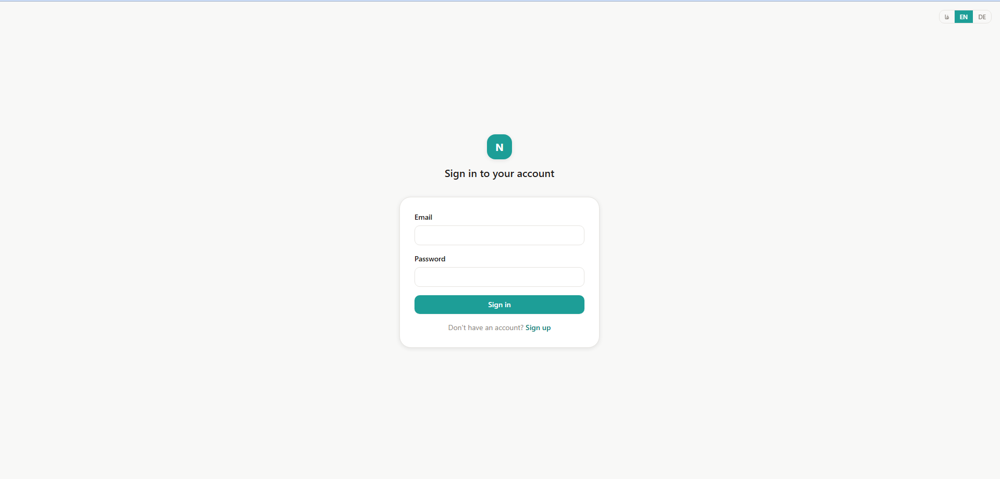
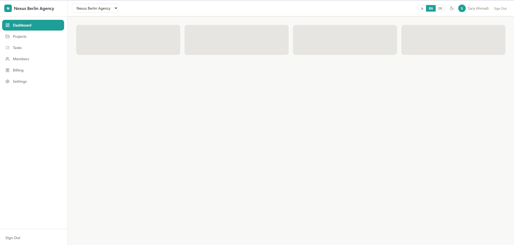

# ⚡ Nexus SaaS - Enterprise Multi-Tenant Management Platform

 [](https://nexus-saas-lilac.vercel.app/login/)
[](https://react.dev/)
[](https://www.typescriptlang.org/)
[](https://tailwindcss.com/)
[](https://tanstack.com/query/latest)
[](LICENSE)

 <a href="https://nexus-saas-lilac.vercel.app/login/"><strong>Explore the Live Demo »</strong></a>

A modern, responsive, and type-safe **SaaS Management & Analytics Dashboard** built with **React 19, TypeScript, TanStack Query, and Tailwind CSS v4**. Nexus SaaS offers a complete solution for project tracking, team collaboration, task workflows, and billing analytics with multi-tenant and role-based access patterns.

<p align="center">
  
</p>
<p align="center">
  
</p>
---

### 🔑 Demo Credentials (Test Accounts)
For instant preview and role testing, you can log in using any of the pre-configured accounts below:

| Role | Email | Password | Access / Scope |
| :--- | :--- | :--- | :--- |
| **Admin** | `admin@nexus.io` | `123456` | Full system access, invoices, project management & user control |
| **Manager** | `manager@nexus.io` | `123456` | Project planning, task assignment & analytics |
| **Member (User)** | `user@nexus.io` | `123456` | Task execution, progress updates & personal overview |

---

## ✨ Key Features

- 🏢 **Multi-Tenant & Role-Based Control (RBAC):** Distinct permissions tailored for Admins, Managers, and Regular Members.
- 📊 **Interactive Analytics & Reporting:** Real-time data visualization using Recharts for budget burn-downs, activity trends, and invoices.
- 📋 **Kanban & Task Management:** Task workflow tracking (`To Do`, `In Progress`, `Review`, `Done`) with tag categorizations.
- 🌍 **Internationalization (i18n):** Multi-language ready architecture configured with `i18next`.
- ⚡ **Optimistic Updates & Caching:** Powered by TanStack Query (React Query v5) for smooth state management and zero unnecessary refetches.
- 🎨 **Modern Design System:** Built with Tailwind CSS v4, Lucide icons, and component reusability best practices.
- 🧪 **Mock API / Offline-ready:** Powered by MSW (Mock Service Worker) & JSON Server for full standalone development and preview.

---

## 🛠️ Tech Stack & Architecture

- **Core:** React 19, TypeScript, React Router 7
- **Styling:** Tailwind CSS v4, `clsx`, `tailwind-merge`
- **Data Fetching & State:** TanStack Query (React Query v5)
- **Forms & Validation:** React Hook Form
- **Data Visualization:** Recharts
- **Localization:** i18next, react-i18next
- **Icons:** Lucide React
- **Mocking & Development Server:** MSW, JSON Server, Vite

---

## 🚀 Getting Started

Follow these steps to set up and run the project locally.

### Prerequisites
- Node.js (v18 or higher recommended)
- npm, yarn, or pnpm

### 1. Clone the repository
```bash
git clone https://github.com/fmadihi/nexus-saas.git
cd nexus-saas
npm install
```
## 📁 Project Structure

```
nexus-saas/
├── public/              # Static assets & MSW service worker
├── src/
│   ├── assets/          # Global images and icons
│   ├── components/      # Modular and reusable UI components
│   ├── hooks/           # Custom React hooks (Data fetching & UI)
│   ├── pages/           # Application views (Dashboard, Tasks, Projects, etc.)
│   ├── routes/          # Application routing & Protected Route handlers
│   ├── services/        # API client and endpoints
│   ├── types/           # TypeScript interfaces and types
│   └── App.tsx          # Main root component & providers
├── db.json              # Mock database configuration
└── package.json
```

---

## 👩‍💻 Author

**Fatemeh Madihi** — Frontend Developer

- **GitHub:** [@fmadihi](https://github.com/fmadihi)
- **LinkedIn:** [Fatemeh Madihi](https://www.linkedin.com/in/fatemeh-madihi/)

